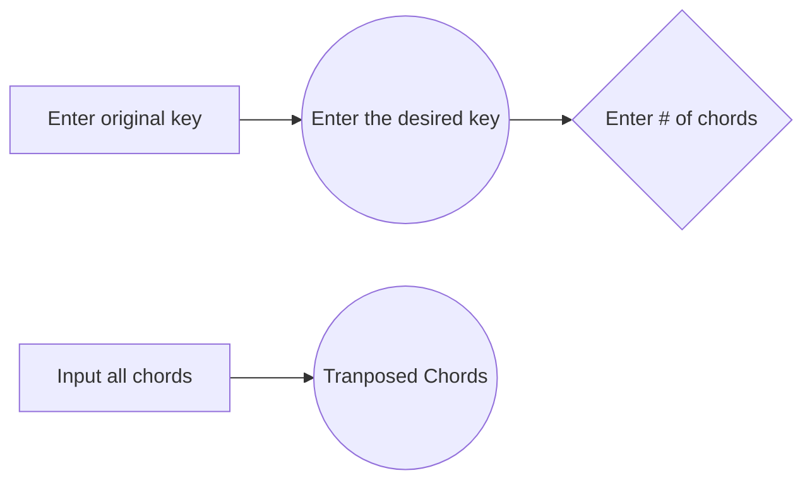

# chord_transposer
Hi! **chord_transposer** is a Python project that sprung as a personal need for a quick, free, and reliable musical chord transposer. 

- I coded this module because chord transposing is **a need for a lot of musicians**
  > 
 
## Software diagram

You can render new transposed chords by following these steps:

